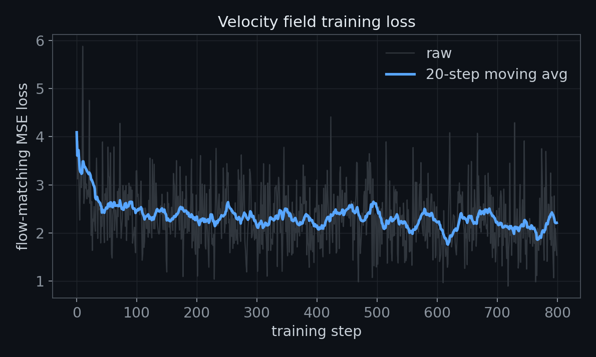
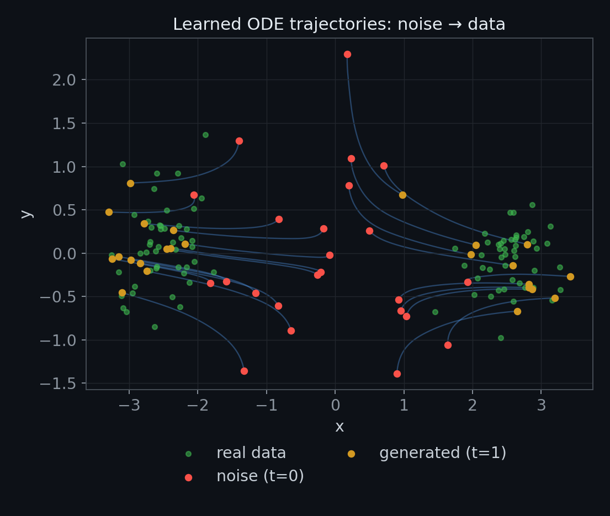
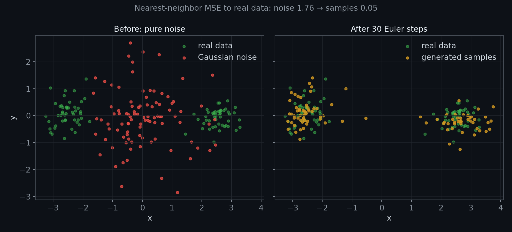
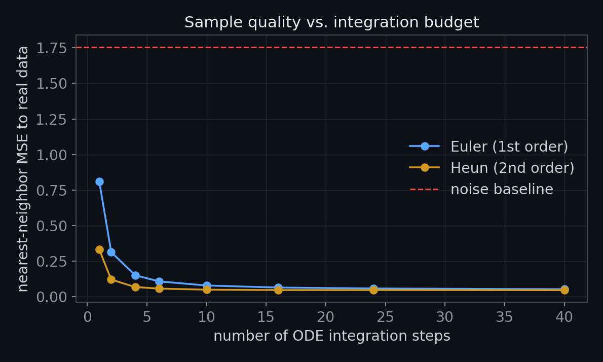
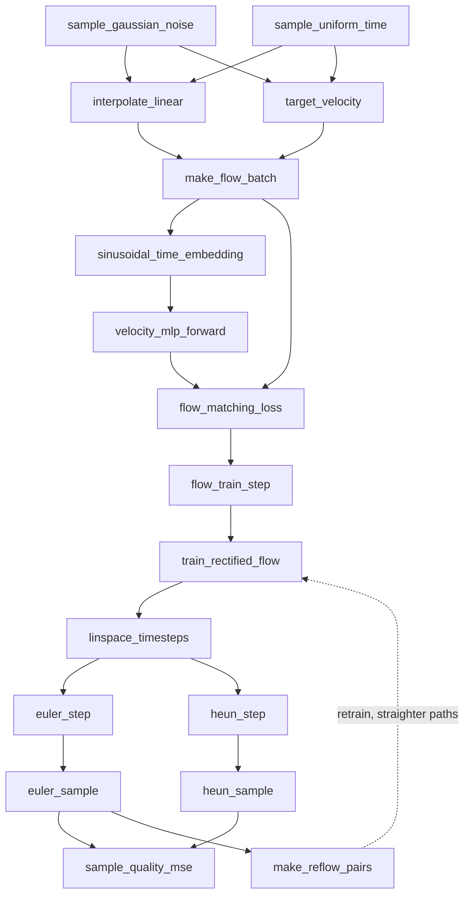

# Rectified Flow from Scratch

A from-scratch, pure-PyTorch implementation of **rectified flow / linear-interpolant flow matching** — the straight-path generative model that displaced DDPM-style diffusion in a lot of recent generative work (Stable Diffusion 3 and InstaFlow both build on this idea).

Instead of learning to reverse a long, discrete Markov noising chain, this model learns a single **velocity field** that carries a Gaussian noise sample to a data sample along a straight line, and then generates by numerically integrating that velocity as an ODE. No noise-prediction network, no thousand-step Markov chain, no variance schedule — just a regression target and an ODE solver.

Every component — the interpolant, the training objective, the MLP, the manual SGD loop, the Euler/Heun samplers, and the reflow procedure — is implemented directly on raw tensors with no `nn.Module`, no autograd-free tricks, and no external training framework, so the mechanics stay visible end to end.

## Why rectified flow, not DDPM

| | DDPM | Rectified Flow |
|---|---|---|
| Learns to predict | noise added at step *t* | constant velocity `x1 - x0` |
| Training path | curved, defined by a noise schedule | **straight line** between noise and data |
| Sampling | reverse a ~1000-step Markov chain | integrate an ODE, 1–50 steps |
| Loss | noise-prediction MSE | velocity-matching MSE |
| Extra step | none | **reflow**: re-pair (noise, generated data) and retrain to straighten the paths further |

Straight paths matter because a straight-line ODE is trivial to integrate — a single Euler step is already correct along it in the population limit — so fewer function evaluations are needed at sampling time than the many small denoising steps DDPM requires.

## Results

Trained on a synthetic two-blob 2-D Gaussian mixture (a stand-in for "real data" that's still complex enough to show a model actually learning bimodal structure, not just collapsing to the mean).

**Training loss** (flow-matching MSE, 800 steps):



The loss plateaus above zero — expected here, since the regression target `x1 - x0` is itself resampled with fresh random noise every step, so the loss floor is the irreducible variance of the noise draw, not underfitting.

**What the network actually learned** — 24 noise samples integrated forward through the learned velocity field, Euler steps, traced end to end:



**Before vs. after** — nearest-neighbor MSE to the real data drops by ~32x after integrating the ODE:



**Euler vs. Heun** — Heun's 2nd-order predictor-corrector reaches good sample quality in far fewer function evaluations than plain Euler:



Numbers from one representative run (`seed=0`, `hidden_dim=64`, `n_train_steps=800`):

```
loss: 4.09 -> 1.54
noise baseline MSE:      1.7567
Euler (30 steps) MSE:    0.0544
Heun  (10 steps) MSE:    0.0486   # fewer steps, better result
```

`python scaffold.py` (a smaller, quick-to-run config) prints:

```
steps: 200
loss: 3.4820 -> 1.7328
noise baseline MSE:  2.4872
trained sample MSE:  0.8022
improvement (noise - sample): 1.6850
reflow pair shapes: (16, 2) (16, 2)
experiment sample/baseline: (0.5652, 2.4827)
```

Regenerate all four figures with real numbers from a fresh run:

```bash
python scripts/make_figures.py
```

## Architecture

The whole pipeline is written as small, pure functions in `model.py` — every box below is one function, wired together exactly as the arrows show.



### File map

```
.
├── model.py                20 functions, one per pipeline step (interpolant -> objective ->
│                            velocity MLP -> training -> ODE samplers -> evaluation -> reflow ->
│                            capstone experiment)
├── scaffold.py             runnable end-to-end demo: trains, samples, reflows, prints results
├── scripts/
│   └── make_figures.py     regenerates every plot in this README from a real training run
├── tests/
│   └── test_rectified_flow.py   12 pytest cases, one per pipeline stage
└── assets/                 generated result figures
```

## How it works

**1. The interpolant.** Given noise `x0 ~ N(0, I)` and a data point `x1`, the training path is just a straight line:

```
x_t = (1 - t) * x0 + t * x1,        t ~ Uniform[0, 1)
```

Its time-derivative is constant along the whole path: `dx_t/dt = x1 - x0`. That constant is the regression target — there's no schedule, no SNR curve, nothing time-dependent about the target itself.

**2. The objective.** A neural network `v_θ(x_t, t)` is trained to predict that constant velocity from the interpolated point and the time it was sampled at:

```
L(θ) = E‖ v_θ(x_t, t) − (x1 − x0) ‖²
```

**3. The network.** Time is embedded with sinusoidal (Fourier) features, concatenated with the state, and pushed through a plain 2-hidden-layer ReLU MLP — implemented as a dict of raw tensors (`W1, b1, W2, b2, W3, b3`) and a functional forward pass, updated with hand-rolled SGD (`p -= lr * p.grad`) so every gradient step is visible.

**4. Sampling.** Generation starts from pure noise at `t=0` and integrates `dx/dt = v_θ(x, t)` forward to `t=1`, using either:
- **Euler** — a single first-order step per interval, `x ← x + dt · v_θ(x, t)`
- **Heun** — a predictor-corrector step that evaluates the velocity at both ends of the interval and averages, giving 2nd-order accuracy at roughly double the cost per step (but far fewer steps needed overall, as the benchmark above shows)

**5. Reflow.** `make_reflow_pairs` runs the current model forward from noise to get `(x0, x̂1)` pairs — instead of the arbitrary random pairing used in the first training pass, the model is now paired with *its own* generated output. Retraining on these self-generated pairs is the namesake "rectification" step: it straightens the ODE trajectories further, which is what lets `InstaFlow`-style models sample in a single step.

## Tests

```bash
pytest -q
```

12 tests exercise every function in `model.py` in isolation — interpolant endpoints, batch shapes, loss values, gradient flow through the MLP, Euler/Heun correctness against a hand-computed constant field, and the end-to-end capstone experiment (trained samples must beat the noise baseline).
